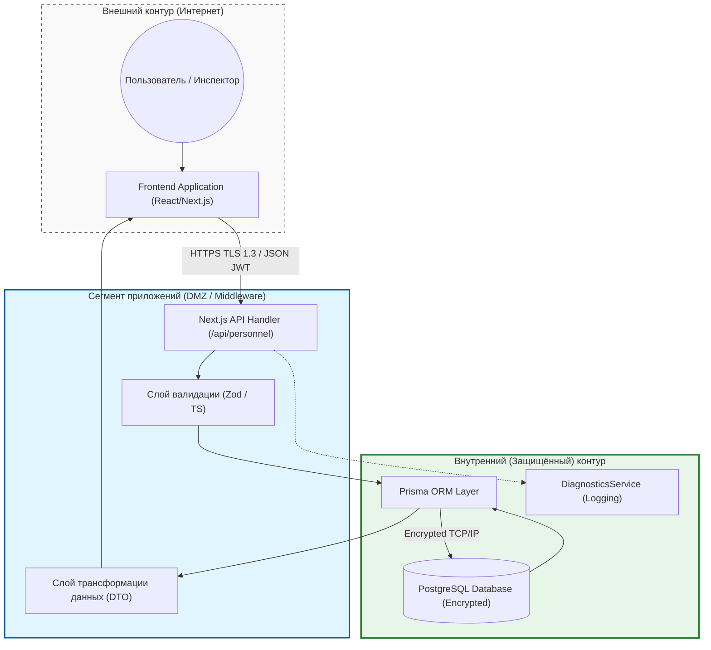
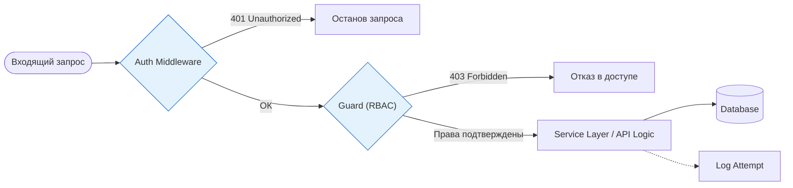

# Техническая документация по информационной безопасности системы «Nazorat-Taftish»
## Для предоставления в ГЦОИБ Республики Узбекистан

### 1. Архитектурная концепция
Система «Nazorat-Taftish» спроектирована с учетом требований ЗРУ-547 «О персональных данных» и ПКМ №702. Основной задачей является обеспечение конфиденциальности, целостности и доступности данных реестра личного состава.

---

### 2. Схема информационных потоков (Data Flow Diagram - DFD)

#### Описание DFD
Архитектура системы построена на **принципе эшелонированной защиты (Defense in Depth)**. Ключевым элементом является **изоляция уровней**: внешнее окружение не имеет прямого доступа к базе данных. Все запросы проходят через слой API и валидацию. Реализация концепции **Privacy by Design** гарантирует, что персональные данные обрабатываются только в объеме, необходимом для конкретной задачи. Использование **параметризации запросов (ORM)** исключает SQL-инъекции. Данная модель полностью соответствует Статьям 27 и 28 ЗРУ-547.

---

### 3. Схема управления доступом (RBAC)

#### Описание реализации RBAC
В системе реализована строгая ролевая модель доступа. Анонимный доступ запрещен. Каждое действие проверяется на соответствие полномочиям пользователя (Инспектор, Менеджер, Администратор). Соблюдается **принцип наименьших привилегий**: в API-ответах возвращаются только разрешенные для данной роли поля. Все попытки доступа, включая ошибки авторизации, логируются сервисом диагностики для последующего аудита.

---

### 4. Меры соответствия законодательству (ЗРУ-547 и ПКМ №702)
1. **Шифрование**: Весь трафик защищен TLS 1.3. Пароли хранятся в виде защищенных хешей.
2. **Аудит**: Логирование действий пользователей в `audit_log`.
3. **Безопасность кода**: Использование типизированного кода (TypeScript) и валидации схем (Zod) для предотвращения переполнения буфера или инъекций.
