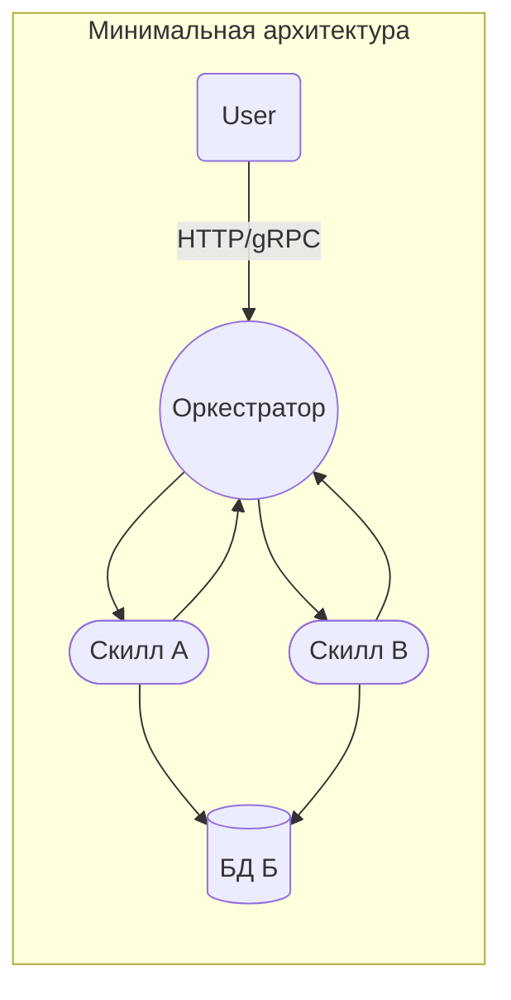
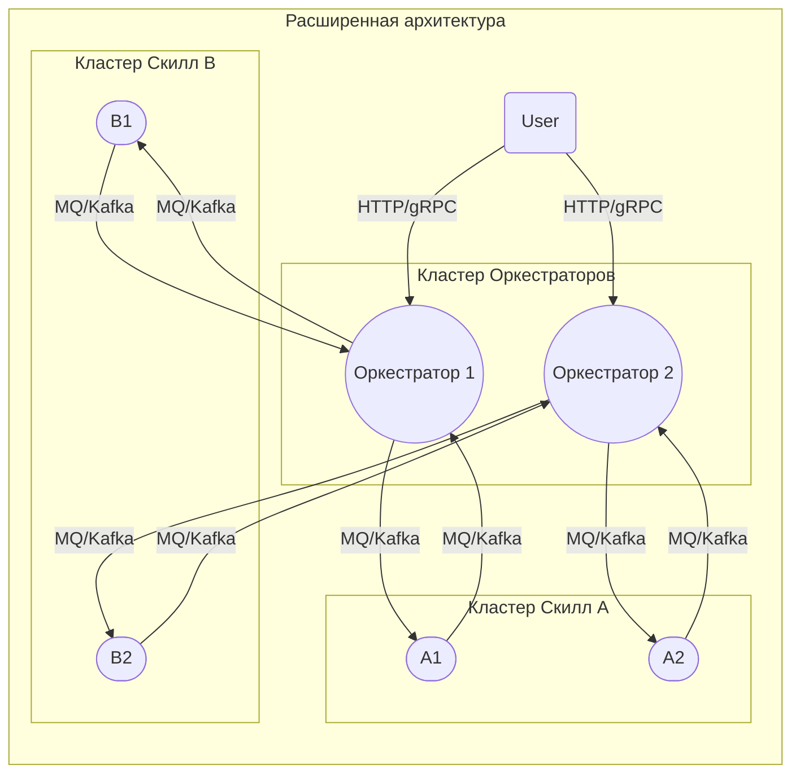
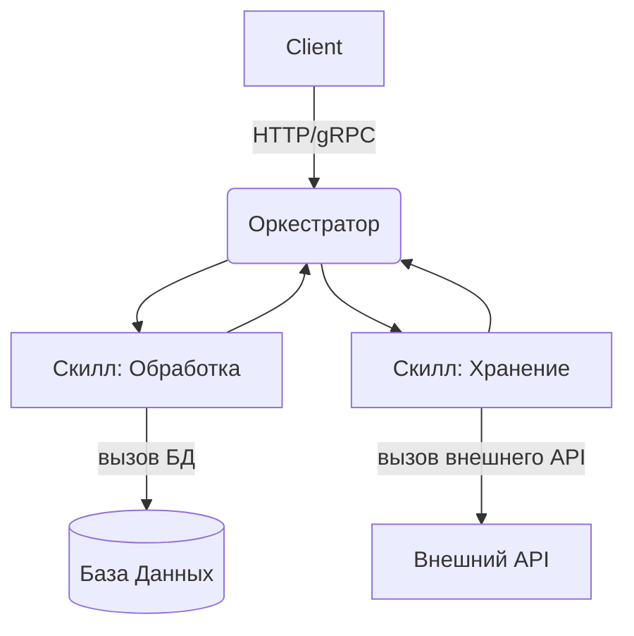
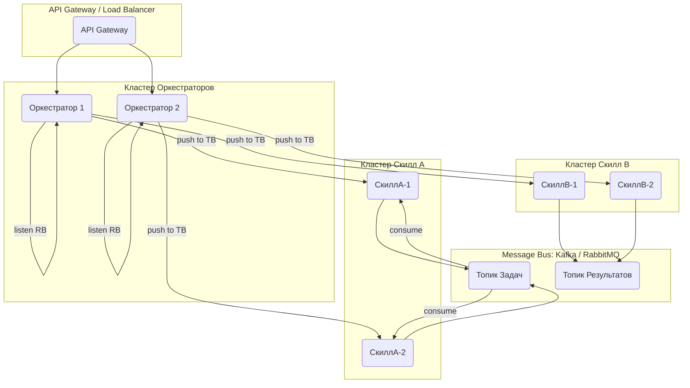

# Исполнительное резюме

В этом отчёте мы **откровенно и лирически** рассмотрим архитектуру системы агентов, скиллов и плагинов для автоматического выполнения входящих задач. Мы подробно разберём **паттерны проектирования**, **форматы данных и протоколы связи**, а также нюансы **дизайна скиллов и плагинов**, **безопасности**, **тестирования** и **эволюции системы**. Каждую технологию и подход подкрепим цитатами из авторитетных источников, а также приведём таблицы и **`mermaid`-диаграммы** для наглядности. Отвечая «как есть» и без прикрас, покажем достоинства и недостатки разных решений, уделяя внимание и традиционным подходам, и перспективным идеям. В окончательном виде читатель получит комплексное представление о том, как *собрать такую систему «от и до»*.

## 1. Анализ архитектурных паттернов

Система агентов/скиллов/плагинов по сути представляет собой распределённое приложение, где каждый элемент отвечает за свою задачу. Основные паттерны архитектуры:

- **Микросервисы (сервисно-ориентированная архитектура):** каждый агент или скилл — отдельный сервис с собственным API. Проще в разработке и масштабировании, но сложнее координировать и отлаживать (сеть вместо вызова функции). Управление связано с контейнерами/Kubernetes. Часто применяется, когда микросервисы уже знакомы команде.
- **Оркестратор vs. хореография:** при оркестрации один центр (или несколько) направляет выполнение задач (похож на дирижёра). Это удобно для сложных рабочих процессов (саги, последовательность шагов). Хореография (Peer-to-peer, pub/sub) — каждый агент реагирует на события других, коммуникация через шину событий. Такой подход меньше связан и более отказоустойчив, но сложнее проследить логику.  
  - *Классика*: «последовательная оркестрация» (pipeline) – «конвейер» задач【50†L1-L9】, когда результат одного шага передаётся на вход следующему. Подходит для линейных процессов с чёткой последовательностью【50†L1-L9】.  
  - *Блэкборд и маркет-модель*: агент публикует данные на общий «черный экран» (база знаний), другие читают и дополняют【54†L679-L687】. Или агенты торгуются и совершенствуют решение (рыночный паттерн)【54†L701-L709】. Оба позволяют декомпозировать сложные задачи на волонтёрских началах.  
- **Событийная шина (Event Bus / Pub/Sub):** все компоненты общаются через посредника (например, Kafka, RabbitMQ). Издатели посылают события, подписчики их обрабатывают. Обеспечивает слабую связанность и масштабируемость. Минус — гарантия доставки (обычно «по крайней мере раз»【13†L132-L140】), нужно обрабатывать дубли и поддерживать идемпотентность.  
- **Peer-to-Peer (P2P):** каждый агент напрямую общается с другими (не очень типично для серверных систем, но встречается в децентрализованных приложениях). Подходит для mesh-сетей, но увеличивает число соединений.

**Плюсы/минусы и когда применять**:

| Паттерн            | Плюсы                                              | Минусы                                               | Когда применять                       |
|---------------------|----------------------------------------------------|------------------------------------------------------|---------------------------------------|
| Микросервисы        | Модульность, независимое масштабирование【42†L285-L290】   | Сложность тестирования【42†L255-L263】 и отладки, сетевые задержки【42†L274-L283】 | Крупные системы, требующие гибкости   |
| Оркестратор         | Централизованное управление, понятный workflow【50†L1-L9】 | Единая точка отказа (SPOF), перегруз при масштабировании | Последовательные цепочки задач       |
| Хореография         | Отказоустойчивость, отсутствие «босса», лёгкая добавка сервисов【15†L128-L137】 | Сложно отслеживать поток, возможны циклы и гонки событий | Событийные системы, нуждающиеся в «рассыпании» |
| Событийная шина     | Масштабируемость, decoupling, удобство обработки больших потоков【54†L605-L613】 | Потребность в обеспечении доставки и идемпотентности【13†L132-L140】 | Массовые асинхронные потоки данных    |
| P2P (друг к другу)  | Минимальная инфраструктура (нет брокера)           | Множество соединений, сложная маршрутизация            | Локальные/распределённые системы      |

*Примеры*: шаблон «оркестратор-рабочий» (master-worker) с Kafka описан в Confluent: центральный процесс раскладывает задачи, а агенты (workers) читают из темы и пишут ответы【54†L605-L613】. Чёрная доска (blackboard) — общий топик событий, где каждый агент может читать/писать информацию【54†L679-L687】.

В целом, **микросервисный подход** (с независимыми сервисами/скиллами) сочетается с оркестратором или шиной для связи. Выбор зависит от сложности логики: для простого pipeline – выбираем последовательную оркестрацию【50†L1-L9】, для сложной динамики – событийную (pub/sub) или хореографию. Всегда стоит помнить: *архитектура – это компромисс между контролем и гибкостью*.

## 2. Модель данных и форматы сообщений

Компоненты общаются по заранее определённым контрактам (API). Важные аспекты:

- **JSON** – текстовый формат, человекочитаемый, гибкий (нет жёсткой схемы). Легко дебажить и интегрировать с браузером/REST. Но достаточно «тяжёлый»: больший размер и медленнее парсинг. Хорош для упрощённой интеграции или конфигураций. Для гарантии формата можно использовать *JSON Schema* (или OpenAPI)【9†L350-L358】.
- **Protobuf** – бинарный формат от Google. Определяется `.proto`-схемой с нумерованными полями. Очень компактен и быстр при сериализации/десериализации【43†L185-L192】. Поддерживает мощные правила версии: к старому сообщению новые поля добавлять безопасно (старый код их проигнорирует)【43†L169-L177】, при удалении полей их номера резервировать. Идеален для gRPC и высокопроизводительных RPC. Недостаток – надо генерировать код и следить за схемой.
- **Avro (Apache)** – бинарный формат с JSON-схемой. Схема всегда сопровождает данные (или хранится в Registry). Очень компактен, обладает гибкой эволюцией полей (backward/forward совместимость по умолчанию)【43†L75-L84】【43†L97-L100】. Популярен в экосистеме Kafka.
- **GraphQL** (если используете GraphQL API) – тоже схема, но это скорее другой подход к API, чем низкоуровневый формат сообщений.

**Сравнение форматов:**

| Формат            | Человечность     | Размер данных  | Скорость      | Совместимость версий            |
|-------------------|------------------|----------------|---------------|---------------------------------|
| JSON (+ Schema)   | Очень высокая (текст) | Большой        | Низкая【9†L350-L358】【43†L133-L142】| Гибкая (нестрогие правила, JSON Schema сложно версионировать)【43†L119-L128】 |
| Protobuf          | Низкая (бинарь) | Очень маленький【43†L185-L192】 | Очень высокая【43†L185-L192】| Жёсткие правила (номера полей) – легко добавлять поля, сложно переименовывать【43†L169-L177】 |
| Avro              | Средняя (схема JSON) | Компактный【43†L97-L100】 | Высокая【43†L95-L100】        | Очень гибкая (автоматическая backward/forward совместимость)【43†L75-L84】 |
| (JSON Schema)     | Очень высокая    | Самый большой  | Самая низкая【43†L133-L142】 | Сложная: устаревание может ломать старые клиенты【43†L119-L128】 |

**API-контракты и версии:** Интерфейсы служб (скиллов) лучше описывать явно (OpenAPI для REST, `.proto` для gRPC). Обязательно указать версии (v1, v2 или semantic versioning) – это позволит безболезненно обновлять контракт. Например, в Protobuf давать новые номера полей при добавлении, не переиспользовать старые【43†L169-L177】. Для REST можно версионировать URL или Header. Отметим: версия протокола/контракта обычно управляема – без прекращения работы старых клиентов【42†L279-L288】.

**Пример схемы:**  

*JSON (OpenAPI) для скилла-поиска:*  
```json
{
  "paths": {
    "/search": {
      "post": {
        "summary": "Выполнить поисковый запрос",
        "requestBody": {
          "content": {"application/json": {
            "schema": {"$ref": "#/components/schemas/SearchRequest"}
          }}
        },
        "responses": {
          "200": {"description": "Успех", "content": {"application/json": {
            "schema": {"$ref": "#/components/schemas/SearchResult"}
          }}}
        }
      }
    }
  },
  "components": {
    "schemas": {
      "SearchRequest": {
        "type": "object",
        "properties": {
          "query": {"type": "string"},
          "limit": {"type": "integer"}
        },
        "required": ["query"]
      },
      "SearchResult": {
        "type": "object",
        "properties": {
          "items": {
            "type": "array",
            "items": {"type": "string"}
          }
        }
      }
    }
  }
}
```

*Protobuf-сервис для скилла:*  
```proto
syntax = "proto3";
package skills;

message SearchRequest {
  string query = 1;
  int32 limit = 2;
}

message SearchResult {
  repeated string items = 1;
}

service SearchSkill {
  rpc Search(SearchRequest) returns (SearchResult);
}
```

Такой контракт позволяет автоматически сгенерировать клиент/сервер и гарантирует, что все участники понимают формат сообщений. 【9†L350-L358】【43†L169-L177】

## 3. Протоколы связи и маршрутизация запросов

**Виды протоколов:**  
- **HTTP/REST:** самый распространённый способ (JSON/HTTP API). Прост в использовании, интеграции, поддерживается всеми платформами. Каждый запрос – отдельное соединение (HTTPS), что добавляет латентности. Методы GET/POST могут быть идемпотентными/неидемпотентными по смыслу (GET – да). Хорош для синхронных запросов к скиллам (запрос-ответ).  
- **gRPC:** надстройка над HTTP/2 с бинарными сообщениями (обычно Protobuf). Поддерживает стримы, мультиплексирование соединений. Быстрее и эффективнее HTTP/JSON【9†L350-L358】. Однако требует больше настроек (генерация кода, регистрация манифестов). Отлично подходит для внутренних сервисов с высокой нагрузкой и сложной типизацией.  
- **WebSocket:** постоянно открытое двунаправленное соединение. Используется для real-time уведомлений или длинных интерактивных сессий. Меньше накладных расходов на установку связи, но сложнее шардировать. Подходит, если нужно быстро пушить события клиентам (например, контроллеру или UI).  
- **Message Queue / Pub-Sub (AMQP, Kafka, MQTT и др.):** асинхронные протоколы. Отправитель помещает сообщение в очередь/топик, получатель читает независимо. Обычно гарантируется «минимум одна доставка» (at-least-once)【13†L132-L140】. Это повышает надёжность, но нужно обрабатывать дубликаты (см. идемпотентность ниже). Очереди удобны для фоновых задач и событий.

**Гарантии доставки и идемпотентность:**  
Большинство брокеров даёт *at-least-once* по умолчанию【13†L132-L140】. Например, Cloudflare Queues «гарантирует доставку как минимум один раз»【13†L132-L140】. В редких случаях сообщение может прийти дважды. Поэтому сервисы должны работать идемпотентно: при повторении одного и того же запроса результат должен не меняться【13†L140-L147】【19†L86-L90】. Как советует AWS, проектируйте API так, чтобы повторы были «безопасными» (например, любые побочки не приводили к дублированию эффекта)【19†L86-L90】.

**Маршрутизация запросов:**  
Часто используем **API Gateway** или Service Mesh (Envoy, Istio), чтобы скрыть детали микросервисов от клиента и централизовать аутентификацию/логирование. В простейшем случае маршрутизация делается на уровне URL/хостнейма: агентами выступают разные сервисы, каждый на своём пути. При использовании очередей или брокеров задачи поступают в топики по ключам (partition keys)【54†L605-L613】. Например, оркестратор может публиковать команды в топик с ключом «<тип_скилла>», а соответствующие скиллы — читать нужные сообщения.

**Транзакции и саги:**  
Для сложных рабочих процессов, затрагивающих несколько сервисов, прямые распределённые транзакции (2PC) нежелательны из-за высокой нагрузки и отказоустойчивости. Вместо этого используют **паттерн Сага**【15†L41-L47】: каждая операция выполняется локально и подтверждается событием; если что-то идёт не так, запускаются компенсирующие операции【15†L99-L107】. Сага может реализовываться через централизованный оркестратор (орchestration, централизованный контроллер) или через хореографию (каждый сервис сам публикует событие при завершении). В любом случае следует проектировать процессы с учётом возможности частичного отката.

## 4. Дизайн скилов

Каждый скилл (сервис-исполнитель) должен иметь чётко описанный интерфейс и отвечать за свою задачу. Основные рекомендации:

- **Интерфейс и контракт:** определите API (REST или gRPC) с конкретными входными/выходными данными (см. раздел 2). Используйте OpenAPI/JSON Schema или Protobuf IDL для автоматизации и валидации. Документируйте контракты – так потребители точно знают, как пользоваться скиллом. Версионируйте API (v1, v2 и т.д.)【42†L279-L288】, чтобы менять логику без сбоев у старых клиентов.
- **Управление состоянием:** по возможности делайте скиллы *статистически независимыми* (stateless). Тогда их проще масштабировать и перезапускать. Если нужен state, храните его во внешних сервисах (БД, кеш). Например, хранилище сессии или состояния задачи в Redis или SQL. Это разделяет логику обработки и данные, повышая надёжность.
- **Безопасность и права доступа:** проверяйте авторизацию на границе сервиса (OAuth2, JWT, API ключи). Каждый вызов должен иметь токен/ключ с нужными правами. Шифруйте трафик (TLS/HTTPS) и используйте *mTLS* для доверенной связи между сервисами【32†L89-L98】【32†L115-L124】. Не доверяйте внешним входным данным – применяйте валидацию схемы (см. раздел 8), чтобы предотвратить атаки на основе некорректных сообщений【34†L219-L228】.
- **Таймауты и ретраи:** задавайте таймауты для внешних вызовов, чтобы незавершённый запрос не «висял» бесконечно【19†L101-L110】. AWS рекомендует устанавливать параметры так, чтобы было мало ложных таймаутов, но при этом система не простаивала долго на одном запросе【19†L108-L117】. Если ответ не пришёл, можно *повторить запрос* (retry) с экспоненциальной задержкой (backoff) и джиттером (случайная фаза)【19†L82-L90】【19†L93-L100】, чтобы избежать «ада массовых повторов» при сбоях. Важно: сам скилл должен быть идемпотентным (см. раздел 3), тогда повторный запрос не приведёт к двойному выполнению побочных эффектов【19†L86-L90】.
- **Логи и мониторинг:** каждый скилл в проде должен логировать ключевые события (входящие запросы, ошибки). Лучше централизованно (ELK/Graylog). Для отслеживания запросов через систему используйте уникальные ID (correlation ID) и распределённый трейсинг (OpenTelemetry/Jaeger).
- **Метрики качества:** измеряйте время ответа, количество ошибок, загруженность. Это позволит отслеживать SLA и быстро реагировать на проблемы.

Таким образом, каждый скилл – чётко определённая микрофункция с надёжной обвязкой (безопасность, таймауты, ретраи, логирование).

## 5. Плагины

Плагины – это расширяемые модули, загружаемые в рантайме, которые дают системе новые возможности без перезапуска. Особенности дизайна:

- **Sandboxing/Изоляция:** чтобы плагин не нарушил стабильность системы, запускайте его в изолированном окружении. Например, контейнер, отдельный процесс, виртуальная машина или среда WebAssembly (WASM). Microsoft советует использовать **AssemblyLoadContext** в .NET для загрузки плагина【47†L42-L51】, но отмечает: *«неполезно загружать недоверенный код в надёжный процесс»* – лучше запускать его под отдельной песочницей ОС【47†L55-L60】.
- **Динамическая загрузка и обновление:** плагин должен иметь манифест (например JSON-файл) с описанием: название, точка входа, зависимости. Система мониторит папку или реестр плагинов и может «горячо» подключить новый плагин. При этом желательно предусмотреть версионирование API плагина, чтобы старые версии продолжали работать, пока не будут отключены.
- **API для расширения:** определите, каким образом плагин взаимодействует с ядром. Например, публикуйте интерфейс (SDK) для плагинов: скилл-платформа из примера использует интерфейс `ICommand` (имя, описание, метод `Execute()`)【47†L148-L157】. Это гарантирует, что плагин реализует необходимые методы. Аналогично, в веб-приложениях может быть «host API» – функции, которые плагин может вызывать【22†L27-L36】.
- **Управление зависимостями:** плагин может требовать библиотеки. В .NET примеру показано использование `AssemblyDependencyResolver` для отдельного контекста плагина【47†L42-L51】. В JavaScript можно грузить модуль `npm` через `require` или динамические импорты. Главное – чтобы зависимости плагина не конфликтовали с ядром (отдельный неймспейс).
- **Безопасность:** минимизируйте привилегии плагина. Например, не давайте прямого доступа к внутренним REST API ядра; используйте чётко ограниченный интерфейс. Периодически проверяйте обновления плагинов на предмет уязвимостей.
- **Версии и совместимость:** как и у API, у плагинов должна быть версия. При несовместимом изменении API плагина публикуйте новую версию манифеста.

Пример (упрощённый) описания плагина в виде JSON-манивеста:
```json
{
  "name": "WeatherPlugin",
  "version": "1.2.0",
  "entryPoint": "plugins/weather/index.js",
  "permissions": ["accessExternalAPI", "readLogs"],
  "dependencies": {
    "axios": "^0.21.0"
  }
}
```
Такой подход позволяет операционно безопасно подгружать и изолировать плагины. Известный кейс: разработка плагин-архитектуры в React-приложении описана как контролируемый *host API* и изолированные бандлы【22†L27-L36】.

## 6. Оркестрация выполнения задач

Система должна координировать выполнение комплексных задач через множество агентов и скиллов. Ключевые моменты:

- **Планирование и распределение:** входящие запросы (или внутренние задачи) ставятся в очередь/брокер. Оркестратор выбирает задачу по приоритету и назначает подходящему агенту. Можно использовать простые алгоритмы (Round-Robin, Least-Loaded) или более сложные планировщики. Кластеры Kubernetes позволяют запускать множество инстансов каждого компонента, а оркестратор (либо сам система Kubernetes) распределяет нагрузку. Для отложенных задач подходит CRON/таймер или отдельная очередь задач.
- **Приоритеты:** если система должна обслуживать разные важности запросов, используйте очереди с приоритетом (некоторые брокеры поддерживают) или разграничивайте очереди «срочная»/«обычная». Например, билетная система «критическая заявка» обрабатывается в первую очередь.
- **Параллелизм:** разные задачи могут обрабатываться параллельно разными агентами. Оркестратор может поручить один запрос нескольким скиллам одновременно (динамический pipeline). Для параллелизма внутри одного шага помогают продюсеры/консьюмеры: несколько экземпляров скилла забирают задачи из одной очереди. Базы данных и очереди обычно поддерживают параллельное чтение (sharding, партицирование)【54†L605-L613】.
- **Откат и компенсации:** если часть цепочки дала сбой, можно применять компенсирующие транзакции или отказаться от всей цепочки. В разделе 3 мы уже упомянули *паттерн Саги*【15†L99-L107】. Оркестратор может фиксировать прогресс (состояние каждого шага) и при неудаче идти назад. Некоторые решения (Temporal, Cadence) вообще встроены для таких workflow, автоматически сохраняя состояний.  
- **Логирование и трассировка:** журналируйте ход выполнения задач – кто когда что сделал, коды ошибок. Используйте распределённый трейсинг (например, OpenTelemetry) для связывания запросов между сервисами. Так можно найти «бутылочное горлышко» и причину отказа. IBM подчёркивает: без **централизованной наблюдаемости** (tracing, logs, metrics) отладка микросервисной системы становится почти невозможной【42†L311-L320】.
- **Устойчивость:** внедрите **Circuit Breakers** и **Fallback** (паттерны отказа), чтобы не допустить лавинообразного каскада ошибок. Если один скилл временно упал, не посылайте ему бесконечные запросы – переключитесь на запасной вариант или верните ошибку пользователю. Повторные попытки (retry) выполняйте с ограничением количества попыток.

Пример схемы (в общем виде) minimal и расширенной оркестрации ниже (см. раздел 11). В минимальной архитектуре все запросы идут через единый **Оркестратор** (или API-шлюз), который вызывает требуемый скилл. В расширенной — оркестратор и скиллы представлены кластерами, взаимодействуют через брокер сообщений и балансировщики.





(Диаграммы *mermaid* показывают, что в расширенной системе Оркестратор и скиллы дублируются для масштабирования, а связь идёт через очередь/топики.)

## 7. Примеры паттернов связывания

Рассмотрим несколько способов «связать» агентов/скиллы при выполнении запроса:

- **Цепочка вызовов (Chain)**: Оркестратор вызывает первый скилл, тот возвращает результат, который сразу передаётся второму скиллу и т.д. Это классический последовательный pipeline. Подходит для многоступенчатой обработки: например, парсинг запроса → генерация запроса в БД → обработка результата → формирование ответа【50†L1-L9】.  
  *Пример последовательности:* Клиент→Оркестратор -> Скилл1 -> Скилл2 -> Клиент.  
- **Событийно-ориентированный (Event-Driven)**: Оркестратор или скилл публикует событие («запрос обработан»), подписанные агенты на него реагируют. Например, после сохранения данных Скиллом1 сразу посылается событие «данные готовы», и Скилл2 начинает свою работу. Такая модель похожа на **хореографию** – каждый знает, на какие события ему реагировать.  
- **Pub/Sub (Издатель-подписчик)**: Скиллы публикуют сообщения в общий топик, а нужные подписчики их читают. Здесь издатель не знает, кто подписан; транспорт (например, Kafka или Redis) разошлёт всем, кто «в теме». Это удобно, когда к одной задаче нужно привлечь несколько параллельных действий.  
- **Callback (обратный вызов):** Скилл получает URL или callback-функцию от клиента: после обработки он сам инициирует HTTP-запрос обратно на указанный адрес (или вызывает переданный callback). Например, агент по транзакциям может отправлять webhook-уведомление по завершении операции. Это гибрид синхронной и асинхронной модели.  
- **Webhook:** Это частный случай событийной модели для внешних систем. Когда у вас есть внешний сервис, который должен получить результат, вы регистрируете его URL и при наступлении события («платёж проведён») делаете POST на этот URL. Отличие от pub/sub в контроле: webhooks говорят, куда слать (publisher контролирует endpoint), тогда как в pub/sub публикуемый объект достанется всем подписчикам темы【29†L181-L189】【29†L197-L205】.

Каждая последовательность зависит от бизнес-логики. Например, цепочка хороша для «ступенчатых» задач, а pub/sub – когда одно событие должно параллельно запустить несколько агентов. Svix описывает: **webhook** – это прямая связь “point-to-point” по событию, а **pub/sub** – широковещательный шаблон (сообщение достанется всем подписчикам)【29†L181-L189】. В контексте системы агентов можно комбинировать эти паттерны: например, публикация события в шину (pub/sub) после каждого шага цепочки (chain), или возврат в ответ callback-индикации.

## 8. Безопасность

Безопасность стоит строить по принципу «не доверяй, проверяй»:

- **Аутентификация и авторизация:** Каждый запрос к агенту или скиллу должен быть снабжён токеном/ключом. Подойдут OAuth2/JWT (JSON Web Token) или API-ключи. JWT удобен тем, что сам содержит всю информацию о пользователе и правах【32†L77-L85】. Убедитесь, что у каждой службы есть своя роль/домен и минимальные привилегии. Микросервисы часто размещают аутентификацию в API Gateway или отдельном Auth-сервисе, чтобы не дублировать логику.  
- **Шифрование:** Всю сетевую коммуникацию защищайте TLS/HTTPS. При внутреннем трафике можно использовать **mTLS** (двусторонняя TLS-аутентификация) для верификации каждого сервиса【32†L115-L124】. Это особенно важно в zero-trust окружении, чтобы исключить MITM и подмену сервисов.  
- **Валидация входных данных:** Никакие данные извне нельзя считать безопасными. На входе в каждый сервис (интерфейс) выполняйте строгую проверку: соответствие JSON-схеме, размеры полей, regex-белые списки и т.д. OWASP рекомендует валидировать всё на ранней стадии【34†L219-L228】. В противном случае малейшая «неправильная» строка может привести к SQL-инъекции, XSS или отказу сервиса. Всегда используйте *allowlist* подход (что разрешено), а не блокировку черных списков【34†L254-L263】.  
- **Ограничение ресурсов:** Устанавливайте лимиты: по времени исполнения запроса (таймауты), по памяти/CPU (cgroup, Kubernetes requests/limits). Это не даст «чужому» запросу захватить всю машину. Также вводите **rate limiting** на уровни API (между сервисами и для входящих пользователей)【32†L41-L50】. Ограничение количества запросов противодействует DDoS-атакам и защищает систему от неожиданного штурма (например, если кто-то спамит ваш API).  
- **Валидация и санитаризация:** Для всех входных параметров (например, URL, JSON поля, файлы) проверяйте тип, длину, диапазон. Не забудьте проверить загружаемые файлы: формат, размер, вирусы. Иногда имеет смысл иметь «вафель» (WAF) или регуляторы трафика на входе.  
- **Внешние библиотеки:** Следите за уязвимостями зависимостей (supply chain security). Обновляйте плагины и библиотеки своевременно. Используйте официальные образы/репозитории и сканирование контейнеров.

В целом, слой безопасности строится по принципу «многослойная защита»【32†L133-L142】【32†L135-L144】: аутентификация (JWT/mTLS), авторизация, шифрование, валидация, и, наконец, мониторинг безопасности (фиксирование попыток взлома и подозрительных запросов). Следование этим практикам минимизирует риск атак и утечек.

## 9. Тестирование и валидация

Для надёжности системы нужны все уровни тестирования:

- **Unit-тесты:** проверяют отдельные функции/классы/методы внутри каждого скилла или агента. Они быстрые и должны охватывать логику обработки данных. Хороший юнит-тест – гарант того, что один сервис правильно работает при различных входных данных【36†L773-L781】.
- **Integration-тесты:** проверяют взаимодействие нескольких компонентов. Например, тест оркестратора вместе с одним реальным или мокнутым скиллом; или проверка работы скилла с настоящей БД. Это более дорогостоящие тесты, потому что требуют поднять несколько служб【36†L780-L785】. Но без них нельзя быть уверенным, что «все вместе» правильно соединяется.  
- **Contract-тесты (соглашения):** часто в микросервисах делают тесты контрактов – проверяют, что сервис соответствует своему API. Например, consumer-driven tests: каждый потребитель сервиса проверяет его ответы по своим ожиданиям. Это позволяет локализовать поломку при изменении контракта.  
- **End-to-End (E2E):** симулируют полный сценарий работы системы от начала до конца. Например, имитируется пользовательский запрос, и проверяется, что весь цепочек агентов выполнил задачу и вернул корректный ответ. Такие тесты медленные (надо поднимать большую часть системы), но они показывают, что архитектура в целом жива.  
- **Нагрузочное тестирование:** важно оценить производительность при пиковых нагрузках. Прогоните сценарии с большим количеством одновременных запросов, чтобы выявить узкие места, утечки памяти, проблемы с блокировками и т.д.  
- **Тестовые сценарии:** разрабатывайте реальные кейсы использования – «почему» и «зачем» работает система. Например: «одновременный запрос нескольких клиентов», «ошибка одного агента», «добавление нового скилла». Это поможет проверить robustness.  
- **Метрики качества:** метрики покрытия кода, среднее/макс время ответа, количество ошибок (error rate), процент успешных транзакций. Мониторьте их в CI/CD. Стремитесь к высокому покрытию unit-тестами, но не жертвуйте качеством сценариев.  

По Atlassian: unit-тесты лёгкие и быстрые【36†L773-L781】, интеграционные – медленнее, но важные【36†L780-L785】. При тестировании микросервисов также рекомендуется использовать контейнеры/тестовые окружения (Docker Compose, тестовый Kubernetes), чтобы все службы могли «общаться» как в продакшене.

## 10. Рекомендации по реализации

**Стек технологий:** выбирайте зрелые инструменты с хорошей поддержкой и документацией.

- **Языки программирования:** привычны серверу – например, Go (графичен и эффективен в канализации RPC), Java/Kotlin (богат экосистема Spring Boot, Micronaut), C#/.NET (в составе Windows-серверов и кроссплатформенных сборок), Python (Django/Flask/FastAPI). Выбор зависит от компетенций команды.
- **Фреймворки:** для API – Spring Boot (Java), ASP.NET Core (C#), FastAPI или Django/Flask (Python), NestJS/Express (Node.js). Каждый поддерживает OpenAPI или gRPC.  
- **gRPC:** официальная библиотека gRPC позволяет генерировать код в любом языке. Google рекомендует Protobuf за совместимость и производительность【9†L350-L358】.  
- **JSON/REST:** можно использовать **Swagger/OpenAPI**. Инструменты вроде Swagger UI генерируют документацию автоматически.
- **Очереди/шина:** Apache Kafka – фаворит для событийных систем (используется Confluent Platform). RabbitMQ или NATS подходят для простых очередей. У облаков есть managed-решения (AWS SQS/SNS, Azure Service Bus).  
- **Оркестрация и контейнеры:** Docker+Kubernetes (K8s) – индустриальный стандарт. Для простых задач достаточно Docker Compose. Kubernetes обеспечивает авто-scale, восстановления и rolling-обновления【38†L923-L932】.  
- **Workflow-движки:** если много сложных процессов, рассмотрите Temporal (https://temporal.io) или Apache Airflow/Kedro (для ETL), Netflix Conductor. Temporal упрощает написание саговых рабочих процессов.  
- **Observability:** OpenTelemetry (официальный CNCF-проект) для метрик и трейсинга. Сборщики типа Prometheus+Grafana для метрик, Jaeger/Zipkin для трейсинга. Логирование – ELK Stack (ElasticSearch+Logstash+Kibana) или ELK-альтернативы (Loki, Splunk).
- **Базы данных:** каждая служба использует подходящий хранилище (например, PostgreSQL для структурированных данных, Redis для кешей, Elasticsearch для поиска).  
- **CI/CD и деплой:** GitHub Actions, GitLab CI, Jenkins – автоматизация сборки/развёртывания. Инфраструктуру можно описать Terraform или Kustomize.  
- **Примеры кода:** на *официальных страницах* многих технологий есть примеры и шаблоны. Например, документация .NET по плагинам【47†L42-L51】, гайда Google по gRPC (grpc.io/docs) или Spring Boot по создания REST. Используйте эти ресурсы как эталон кода.

**Шаблоны и примеры API:**  
При написании ориентируйтесь на лучшие практики. Например, официальный туториал по gRPC показывает, как легко заменить Protobuf на JSON, но всё же рекомендует Protobuf за «сильную обратную совместимость, типовую проверку и производительность»【9†L350-L358】.  
Публикуйте контракт API в репозитории (OpenAPI-спецификацию, `.proto` файлы) – это *единственный источник правды*. В таблице ниже приводим обзор рекомендуемых технологий:

| Слой / Задача         | Технологии (официальные примеры)                                 | Примечание                                                                 |
|-----------------------|------------------------------------------------------------------|----------------------------------------------------------------------------|
| REST/HTTP API         | Spring Boot (Java), FastAPI (Python), ASP.NET Core, ExpressJS    | Все поддерживают OpenAPI (Swagger)                                          |
| RPC/gRPC              | gRPC (официальная библиотека, Protobuf)【9†L350-L358】           | Быстро, но требует Protobuf IDL                                            |
| Messaging             | Apache Kafka (Confluent), RabbitMQ, NATS, AWS SNS/SQS            | Kafka – распределённое логирование, RabbitMQ – классический MQ             |
| Auth/SECURITY         | OAuth2 (Keycloak, Auth0), JWT, mTLS                               | JWT стандарт RFC 7519, mTLS для сервисов【32†L89-L98】【32†L115-L124】  |
| Оркестрация задач     | Temporal, Airflow, Kubernetes CronJobs                            | Temporal – микросервисный workflow, Airflow – для данных/ETL               |
| Контейнеры/Orchestration | Docker, Kubernetes, Helm, Terraform                            | Rolling updates, auto-scaling (Kubernetes)【38†L923-L932】                  |
| Observability         | OpenTelemetry, Prometheus/Grafana, Jaeger/Zipkin, ELK             | Официальные проекты CNCF/Cloud Native для мониторинга                      |

(Технологии перечислены только для примера; при выборе отталкивайтесь от требований и компетенций.)

## 11. Примеры архитектур с диаграммами и таблицами

### Минимальная рабочая архитектура

В самой простой конфигурации может быть **1 Оркестратор**, несколько **агентов/скиллов** и посредник (опционально). Ниже схема:



*Описание:* Клиент шлёт запрос, Оркестратор вызывает нужные скиллы (в данном примере – «Обработка» и «Хранение»). Скилл «Обработка» может читать/писать в БД, скилл «Хранение» общается с внешним сервисом. Результат каждого скилла возвращается Оркестратору, который формирует ответ клиенту. Такая архитектура минимальна и подходит для PoC, но масштабируется плохо.

### Расширяемая (микросервисная) архитектура

В более зрелой системе компоненты дублируются и взаимодействуют через брокеры и балансировщики. Рассмотрим следующие элементы: кластер Оркестраторов, несколько типов скиллов, шину событий (Kafka) и API Gateway.



*Описание:* Клиент обращается через API Gateway, который распределяет трафик на Оркестраторы. Оркестратор публикует команды в топик задач (TB). Скиллы (A1, A2) читают задачи параллельно (Kafka consumer group). По окончании работы они публикуют результаты в топик (RB), который оркестратор читает и дальше обрабатывает (возможно отправляя новые задачи другим скиллам). Такой подход легко масштабируется: чтобы добавить мощь, разверните ещё инстансов скиллов или оркестраторов. Кроме того, оркестрирование через шину упрощает отказоустойчивость – при падении одного потребителя Kafka перераспределит его партиции автоматически.

### Сравнительная таблица опций

Ниже приведены примеры сравнения (типовые шаблоны) технологий:

**Таблица: Сравнение протоколов связи**

| Протокол      | Использование              | Поток данных    | Плюсы                          | Минусы                   |
|---------------|---------------------------|-----------------|--------------------------------|--------------------------|
| HTTP/REST     | Запрос-ответ, CRUD       | Синхронный       | Простой, универсальный         | Высокие накладные, нет Push |
| WebSocket     | Real-time связь, поток   | Двусторонний поток | Постоянное соединение, low-latency | Сложнее масштабировать   |
| gRPC (HTTP/2) | RPC с бинарными данными  | Одно- или двунаправленные стримы | Высокая производительность, мультиплексирование【9†L350-L358】 | Требует контрактов, сложнее настроить |
| MQ / Pub-Sub  | Асинхронный обмен сообщениями | Сообщения в очереди | Устойчивость, decoupling      | По умолчанию at-least-once (нужна идемпотентность)【13†L132-L140】 |

**Таблица: Архитектурные паттерны**

| Паттерн          | Пример использования                   | Плюсы                                       | Минусы                                      |
|------------------|----------------------------------------|---------------------------------------------|---------------------------------------------|
| Оркестратор      | Сложные процессы (саги), ETL-пайплайн   | Прозрачный контроль над потоком             | Сложность, узкое место (SPOF), разрастание логики 【54†L605-L613】 |
| Хореография      | Событийные системы, микросервисы       | Нет единой точки отказа, масштабируется    | Трудно отследить цепочки, возможны гонки     |
| Событийная шина  | IoT, Event Sourcing                    | Высокая пропускная способность, устойчивость【54†L605-L613】 | Дублирование, нуждается в идемпотентности【13†L132-L140】 |
| Линейная цепочка | Несложные workflows                    | Легко понять, дебагить                   | Малопараллельная, зависимость одного шага от другого【50†L1-L9】 |

(Из таблиц видно: нет единственно правильного выбора – каждый паттерн хорош в своём сценарии.)

**Пример форматов сообщений:** в разделе 2 уже приведены примеры JSON/OpenAPI и Protobuf. Добавим пример Protobuf-схемы в формате таблицы:

| Опция               | Описание                                       | Пример                                   |
|---------------------|------------------------------------------------|------------------------------------------|
| **JSON + OpenAPI**  | Легко читать, без генерации кода              | См. раздел 2 (SearchRequest JSON выше)   |
| **Protobuf**        | Эффективен по памяти и скорости, строги правила версий【43†L169-L177】 |   
```proto
message Request { string q = 1; }
``` |
| **JSON Schema**     | Валидация полей, известен во многих платформах | `"$ref": "#/components/schemas/MyType"`  |
| **Schema Registry** | Хранит схемы (для Kafka)                      | Avro/Protobuf через Confluent Schema Registry |

## 12. План миграции/эволюции

Добавление новых агентов/скиллов/плагинов без простоя достигается за счёт **контейнеризации и стратегий деплоя**:

- **Контейнеры и оркестрация:** развертывайте каждый сервис в контейнере (Docker). Kubernetes поддерживает *Rolling Update* – при изменении версии контейнера старые поды убиваются постепенно, а новые создаются параллельно【38†L923-L932】. Так достигается «нулевой даунтайм»: пока один под обновляется, за ним сидят старые.
- **API-версионирование:** при изменении контракта добавляйте новый версионированный эндпоинт, пока старые клиенты работают со старым. Например, `/api/v1/...` может жить рядом с `/api/v2/...`. Постепенно переводите клиентов и ретирте старый. В Protobuf просто добавляйте новые поля с новыми номерами (старые клиенты их проигнорируют)【43†L169-L177】.
- **Фич-флаги:** новые функциональности («Агент B», «Скилл X») сначала доставляйте в код, но отключенными. Затем «включайте» их плавно через флаги, наблюдая поведение.  
- **Канареечные релизы:** когда добавляется новый сервис или плагин, сначала запускайте его на ограниченной части трафика. Проверяйте метрики (ошибки, нагрузку). Если всё ок – расширяйте.  
- **Безопасные миграции данных:** если нужен совместный доступ к данным разным версиям, применяйте backward/forward-совместимые схемы БД (например, добавление новых колонок nullable или создание новых таблиц).  
- **Автоматизированное обновление плагинов:** новый плагин выкладывается в систему распространения (образ или zip). Монитор системы загружает его без отключения остальных (плагин может подгружаться через hot-swap). Пример: в .NET советуют просто скопировать сборку (DLL) и настроить контекст загрузки【47†L42-L51】. Аналогично в Node.js – поставить новый модуль `npm`.  
- **Параллельная работа старого и нового кода:** можно при развертывании запускать оба варианта (blue-green). Трафик переключается с зеленого (старого) на синий (новый) постепенно через балансировщик.  

**Пример сценария:** вы хотите добавить новый Скилл «ImageProcessor». В Kubernetes вы создаёте новый Deployment и Service для этого микросервиса и обновляете API Gateway, добавив роутинг. Новые запросы «image/*» направляются на него. Старая логика остаётся нетронутой. Как только убедились в стабильности, можно убрать «заглушки» и сказать фронту использовать этот сервис.

Ключ – **совместимость версий**: изменения в сервисе должны быть плавными. Если что-то не указано (например, ограничений на время развертывания) – принимаем, что можно применять любые бесшовные стратегии.

## 13. Риски и меры смягчения

**Риски** распределённых систем известны:

- **Сложность и отладка:** огромное число компонентов и сетевых взаимодействий затрудняют поиск ошибок. Меры: полная *наблюдаемость* (tracing, логирование)【42†L311-L320】, документирование контрактов, структурированные ошибки. Мониторьте систему (Prometheus/Grafana) – выбросы CPU, рост задержек, частота ошибок.
- **Потери сообщений/дубли:** при использовании очередей не гарантированно exactly-once без издержек. Решение: проектируйте идемпотентные запросы и используйте уникальные ID для дедупликации (Cloudflare рекомендует включать *idempotency key* во внешние API, чтобы внешний сервис мог сам выбросить дубликат【13†L140-L147】). Kafka поддерживает при необходимости транзакции (exactly-once) ценой пропускной способности.
- **Отказы сервисов:** когда сервис падает, зависящие от него падают тоже. Нужен **Circuit Breaker** (например, Resilience4j/CircuitBreaker): если скилл недоступен, вместо тайм-аутов сразу возвращаем быстрый отказ или запасной сценарий.  
- **Расхождение данных:** каждый сервис с собственной БД может «разъезжаться» в данных. Если вы полагаетесь на консистентные транзакции, это риск. Саги и события помогают, но требуют тщательного проектирования.  
- **Накладные расходы сети:** большее число сервисов – больше внутриколичественных RTT. Решение: сократить лишние запросы (агрегировать несколько запросов в один, использовать кеши), тщательно выставлять таймауты и ограничения (см. раздел 4).  
- **Накладные расходы администрирования:** требуется сложная инфраструктура (Kubernetes, CI/CD, наблюдаемость). Команда должна иметь навыки DevOps или платформенные решения.  

**Меры смягчения:**  
- Как пишут в IBM, необходимо **обозначить границы сервисов и автоматизировать управление**【42†L303-L310】【42†L331-L337】.  
- **Обсервабилити:** включите сбор метрик и трейсинг с самого начала. Без этого сложно найти проблемы【42†L311-L320】.  
- **Fallback-решения:** внедрите запасные механизмы (например, если очередь упала, перенаправлять трафик напрямую через HTTP).  
- **Поддержание здоровья:** используйте readiness/liveness пробы в Kubernetes, а также мониторьте SLAs.  
- **Безопасность:** постоянно сканируйте зависимости, обновляйте сертификаты и библиотеки.  
- **Продвинутая организация:** разделите ответственность за сервисы между командами, чтобы избежать рассогласования.  

В заключение, хотя архитектура агентов/скиллов/плагинов даёт гибкость и масштабируемость, она требует серьёзного внимания к оркестрации, наблюдаемости и безопасности. При правильном подходе риски контролируемы: «ведь вы строите будушее, опираясь на уроки прошлого». 

**Источники:** мы использовали официальную документацию (gRPC, Kubernetes, Microsoft Learn), блоги экспертов (Confluent, AWS, Cloudflare, IBM) и руководство OWASP, чтобы подкрепить рекомендации проверенными фактами【9†L350-L358】【13†L132-L140】【15†L99-L107】【19†L82-L90】【34†L219-L228】【42†L311-L320】.

