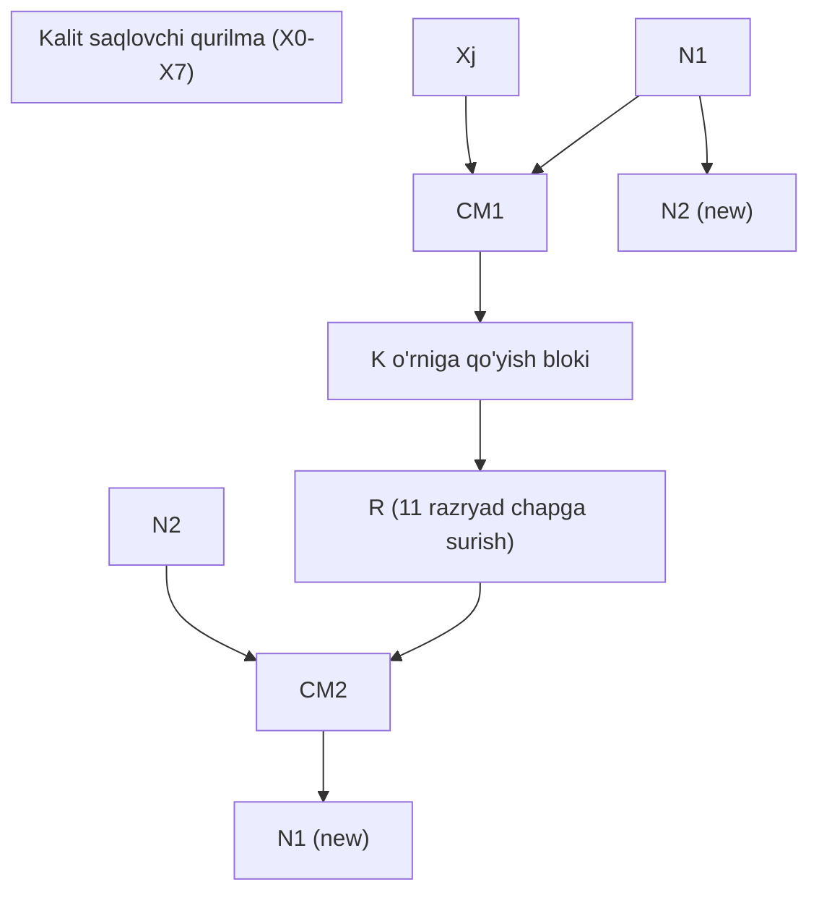
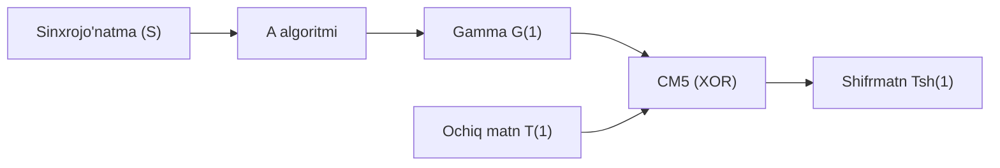

# O‘zbekiston Milliy Standarti (O‘zMSt 270:2024)

**Axborot texnologiyasi**
**AXBOROTNING KRIPTOGRAFIK MUHOFAZASI**
**Ma’lumotlarni shifrlash algoritmi**

*Rasmiy nashr*
*O‘zbekiston standartlar instituti, Toshkent*

---

## So‘z boshi

1. **“UNICON.UZ”** – Fan-texnika va marketing tadqiqotlari markazi” mas’uliyati cheklangan jamiyati (“UNICON.UZ” MChJ) TOMONIDAN ISHLAB CHIQILDI.
2. Axborot texnologiyalari va telekommunikatsiyalar sohasidagi standartlashtirish bo‘yicha texnik qo‘mita TOMONIDAN TAQDIM ETILDI.
3. O‘zbekiston standartlar institutining 2024-yil 30-avgustdagi № 35/MSt-son buyrug‘i bilan TASDIQLANDI.
4. **O‘z DSt 1105:2009 O‘RNIGA ISHLAB CHIQILDI.**

---

## Mundarija

1. [Qo'llanish doirasi](#1-qollanish-doirasi)
2. [Standartlarga havolalar](#2-standartlarga-havolalar)
3. [Atamalar va ta'riflar](#3-atamalar-va-tariflar)
4. [Umumiy qoidalar](#4-umumiy-qoidalar)
5. [1-algoritm (MShA)](#5-1-algoritm)
   - 5.1 Belgilashlar
   - 5.2 Matematik kelishuvlar
   - 5.3 Shifrlash jarayoni
   - 5.4 Shifrning almashtirishlari
   - 5.5 Amalga oshirish masalalari
6. [2-algoritm (AES)](#6-2-algoritm)
7. [3-algoritm (Kriptografik akslantirish)](#7-3-algoritm)
8. [Ilovalar](#8-ilovalar)

---

## 1 Qo‘llanish doirasi

Ushbu milliy standart avtomatlashtirilgan axborot tizimlarida ma’lumotlarni kriptografik muhofazalashda, shu jumladan ma’lumotlarni uzatish, qayta ishlash va saqlash jarayonida maxfiylikni ta’minlash uchun kriptografik usullar qo‘llaniladigan blokli shifrlash algoritmlari va qoidalarini belgilaydi.

Axborot tizimlarida saqlanuvchi va uzatiluvchi ma’lumotlarning kriptografik muhofazasini amalga oshirish uchun davlat tashkilotlari, korxonalari va muassasalari ushbu standartdan foydalanishi majburiydir.

## 2 Standartlarga havolalar

- **O‘zDSt 1047:2018** Axborot texnologiyalari. Atamalar va ta’riflar.
- **O‘zDSt 1109:2013** Axborot texnologiyasi. Axborotning kriptografik muhofazasi. Atamalar va ta’riflar.

## 3 Atamalar va ta’riflar

- **3.1.1 affin akslantirishi**: Matritsaga ko‘paytirish va vektor qo‘shishdan iborat akslantirish.
- **3.1.2 inisializatsiyalash vektori**: Kriptografik algoritm doirasida kriptografik jarayonning tayanch nuqtasini aniqlash uchun ishlatiladigan vektor.
- **3.1.3 kalitlar jadvali**: *Keyexpansion()* amali orqali asosiy kalitdan hosil qilingan raund kalitlari ketma-ketligi.
- **3.1.4 seans kaliti**: Shifrlash kaliti va funksional kalit asosida shakllanadigan maxfiy kalitlarning ikki o‘lchamli massivi.
- **3.1.8 shifrmatn bloklarini ilaktirish rejimi (CBC)**: Har bir shifrlangan kriptografik blok o‘zidan oldingi shifrlangan blokka bog‘liq bo‘lgan shifrlash rejimi.

## 4 Umumiy qoidalar

4.1 Shifrlanadigan axborot matn, ovoz yozuvi va tasvir shaklida, yoki aralash shaklda berilishi mumkin.
4.2 Simmetrik kriptotizimlarda xabarlar almashish uch bosqichda yuz beradi:
- Kalitlarni yuborish (muhofazalangan kanal);
- Shifrlash (himoyalanmagan kanal);
- Deshifrlash (qabul qiluvchi tomonda).

---

## 5 1-algoritm (MShA)

### 5.1 Belgilashlar

MShA **256 bit** uzunlikdagi ma’lumotlar blokini shifrlash uchun **256 yoki 512 bit** uzunlikdagi kalitdan foydalanadi.
- **M** – ochiq ma’lumotlar;
- **S** – shifrmatn;
- **Holat** – 4x8 o‘lchamli baytlar massivi;
- **$\oplus$** – XOR amali.

### 5.2 Matematik kelishuvlar

5.2.1.3 Diamatritsalar algebrasining asosiy amali diamatritsani $p$ modul bo‘yicha teskarilash amali hisoblanadi.

**1-rasm – Maxsus tuzilmali diamatritsa**

| $d_7$ | $d_0$ | $d_1$ | $d_2$ |
| :---: | :---: | :---: | :---: |
| $d_8$ | $d_7$ | $d_8$ | $d_8$ |
| $d_9$ | $d_3$ | $d_7$ | $d_9$ |
| $d_4$ | $d_5$ | $d_6$ | $d_7$ |

Diaaniqlovchi $d$ quyidagicha topiladi:
$$d \equiv d_7 \times (d_7 + d_0 + d_8 + d_3 + d_5) \times (d_7 + d_1 + d_8 + d_9 + d_6) \times (d_7 + d_2 + d_8 + d_9 + d_4) \pmod p$$

### 5.3 Shifrlash jarayoni (Psevdokod)

```pascal
Shifr (int blok_soni, byte IV[32], byte kirish [block_soni][32], 
       byte chiqish [blok_soni][32], byte k[32], byte kf[32], byte e)
begin
    if (m = Sh) then
        ShaklSeansKalitBayt (k, kf)
        for blok = 1 step 1 to blok_soni do
            Holat = kirish[blok]
            for bosqich = 1 step 1 to e do
                Qo‘shBosqichKalit(Holat, Ke)
                Aralash(Holat, Ks)
                Sur(Holat)
                BaytAlmash(Holat, Ba)
            end for
            chiqish[blok] = Holat
        end for
    end if
end
```

---

## 6 2-algoritm (AES / Rijndael)

### 6.4 Shifrning almashtirishlari

#### 6.4.2 SubBytes() (S-Box)

**4-jadval – SBox (o‘n oltilik)**

| x\y | 0 | 1 | 2 | 3 | 4 | 5 | 6 | 7 | 8 | 9 | a | b | c | d | e | f |
| :---: | :---: | :---: | :---: | :---: | :---: | :---: | :---: | :---: | :---: | :---: | :---: | :---: | :---: | :---: | :---: | :---: |
| **0** | 63 | 7c | 77 | 7b | f2 | 6b | 6f | c5 | 30 | 01 | 67 | 2b | fe | d7 | ab | 76 |
| **1** | ca | 82 | c9 | 7d | fa | 59 | 47 | f0 | ad | d4 | a2 | af | 9c | a4 | 72 | c0 |
| **2** | b7 | fd | 93 | 26 | 36 | 3f | f7 | cc | 34 | a5 | e5 | f1 | 71 | d8 | 31 | 15 |
| **3** | 04 | c7 | 23 | c3 | 18 | 96 | 05 | 9a | 07 | 12 | 80 | e2 | eb | 27 | b2 | 75 |
| **4** | 09 | 83 | 2c | 1a | 1b | 6e | 5a | a0 | 52 | 3b | d6 | b3 | 29 | e3 | 2f | 84 |
| **5** | 53 | d1 | 00 | ed | 20 | fc | b1 | 5b | 6a | cb | be | 39 | 4a | 4c | 58 | cf |
| **6** | d0 | ef | aa | fb | 43 | 4d | 33 | 85 | 45 | f9 | 02 | 7f | 50 | 3c | 9f | a8 |
| **7** | 51 | a3 | 40 | 8f | 92 | 9d | 38 | f5 | bc | b6 | da | 21 | 10 | ff | f3 | d2 |
| **8** | cd | 0c | 13 | ec | 5f | 97 | 44 | 17 | c4 | a7 | 7e | 3d | 64 | 5d | 19 | 73 |
| **9** | 60 | 81 | 4f | dc | 22 | 2a | 90 | 88 | 46 | ee | b8 | 14 | de | 5e | 0b | db |
| **a** | e0 | 32 | 3a | 0a | 49 | 06 | 24 | 5c | c2 | d3 | ac | 62 | 91 | 95 | e4 | 79 |
| **b** | e7 | c8 | 37 | 6d | 8d | d5 | 4e | a9 | 6c | 56 | f4 | ea | 65 | 7a | ae | 08 |
| **c** | ba | 78 | 25 | 2e | 1c | a6 | b4 | c6 | e8 | dd | 74 | 1f | 4b | bd | 8b | 8a |
| **d** | 70 | 3e | b5 | 66 | 48 | 03 | f6 | 0e | 61 | 35 | 57 | b9 | 86 | c1 | 1d | 9e |
| **e** | e1 | f8 | 98 | 11 | 69 | d9 | 8e | 94 | 9b | 1e | 87 | e9 | ce | 55 | 28 | df |
| **f** | 8c | a1 | 89 | 0d | bf | e6 | 42 | 68 | 41 | 99 | 2d | 0f | b0 | 54 | bb | 16 |

---

## 7 3-algoritm (Kriptosxema)

**17-rasm – Kriptografik akslantirish algoritmining tarkibiy sxemasi**



### 7.4 Gammalash rejimi

**19-rasm – Gammalash rejimi sxemasi**



---

## 8 Ilovalar

### A ilova: Namunaviy misol (1-algoritm)

**Kirish bloki (Ochiq matn):**
`30 31 32 33 34 35 36 37 38 39 41 42 43 44 45 46 30 31 32 33 34 35 36 37 38 39 41 42 43 44 45 46`

**Shifrlash kaliti K:**
`37 B6 0B BA 0A B1 60 CF DC 18 F5 0C DE E8 E0 45 30 B3 F8 AF 14 32 FE 51 1F BB 20 29 11 2F 21 43`

---

## Bibliografik ma’lumotlar

**Muhim so‘zlar:** ma’lumotlarni shifrlash algoritmi, shifrmatn, kalit, seans kaliti.
