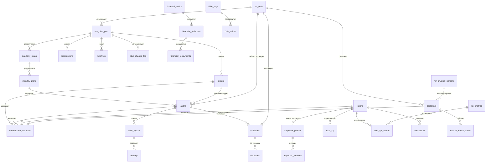

# ПРИЛОЖЕНИЕ Д
# ER-МОДЕЛЬ БАЗЫ ДАННЫХ
# АВТОМАТИЗИРОВАННОЙ ИНФОРМАЦИОННОЙ СИСТЕМЫ
# КОНТРОЛЬНО-РЕВИЗИОННОГО УПРАВЛЕНИЯ
# МИНИСТЕРСТВА ОБОРОНЫ РЕСПУБЛИКИ УЗБЕКИСТАН
# (АИС КРУ МО РУЗ)

«Является неотъемлемой частью Технического задания № AIS-KRR-2026. Расположение основного документа: ..\Технические_задания_АИС_КРР.md. Статус: Обязательное.»

---

## Д.1. ОБЩИЕ ПОЛОЖЕНИЯ

### Д.1.1. Назначение

Настоящее приложение определяет структуру базы данных АИС «КРР»: основные сущности, ключевые атрибуты и связи между ними. Полная актуальная модель данных хранится в виде файла Prisma-схемы (`prisma/schema.prisma`); из неё формируются:

- DDL-скрипты PostgreSQL 15 (через `prisma migrate`);
- DBML-документация (через `prisma-dbml-generator`);
- TypeScript-типы (`@prisma/client`).

### Д.1.2. Технические допущения

1. **СУБД:** PostgreSQL 15 с расширением `pgcrypto`.
2. **Тип первичных ключей:** `INT @default(autoincrement())` для большинства сущностей; `String` (UUID/код) — для классификаторов с естественными ключами.
3. **Метки времени:** `created_at`, `updated_at` — `TIMESTAMPTZ`; даты — `DATE`.
4. **Денежные значения:** `Decimal(18, 2)` (PostgreSQL `NUMERIC(18,2)`).
5. **Локализованные поля:** `Json` (структура `{ru: string, uz_cyrl: string, uz_latn: string}`).
6. **Безопасность:** Row-Level Security (RLS) на всех операционных таблицах согласно Приложению Ж; шифрование чувствительных полей через `pgcrypto`.

---

## Д.2. ГРУППЫ СУЩНОСТЕЙ

База данных АИС «КРР» включает **65 сущностей**, разделённых на логические группы:

| Группа | Кол-во | Назначение |
|--------|:------:|------------|
| **Операционные (ПС-1, ПС-3, ПС-4)** | 14 | Планы, приказы, ревизии, нарушения |
| **Кадры (ПС-5)** | 3 | Профили инспекторов, ротации, расследования |
| **KPI (ПС-2)** | 2 | Метрики и оценки эффективности |
| **Уведомления (ПС-10)** | 1 | Центр уведомлений |
| **Локализация (ПС-9)** | 3 | Динамические переводы |
| **Администрирование/ИБ (ПС-8)** | 4 | Пользователи, журнал аудита, документы, логи просмотра |
| **НСИ — справочники (ПС-7)** | 38 | Префикс `ref_*` |

---

## Д.3. ОПЕРАЦИОННЫЕ СУЩНОСТИ (ПС-1, ПС-3, ПС-4)

| Сущность | Назначение | Ключевые атрибуты |
|----------|-----------|-------------------|
| `rev_plan_year` | Годовой план КРР (главная сущность планирования) | `plan_id` PK, `year`, `plan_number`, `start_date`, `end_date`, `status`, `unit_id` FK, `responsible_id` FK, `approved_by_id` FK, `period_type`, `control_authority_id`, `inspection_direction_id`, `inspection_type_id` |
| `quarterly_plans` | Квартальные подразделы плана | `id` PK, `annual_plan_id` FK → `rev_plan_year`, `quarter`, `year`, `status` |
| `monthly_plans` | Месячные подразделы плана | `id` PK, `quarterly_plan_id` FK, `month`, `year`, `status` |
| `plan_change_log` | Журнал изменений плана | `id` PK, `plan_id` FK, `change_type`, `description` |
| `orders` | Приказы (основания для проверок) | `id` PK, `order_number` UNIQUE, `order_date`, `issuer_id` FK, `plan_id` FK, `unit_id` FK, `order_type`, `status` |
| `prescriptions` | Электронные предписания | `id` PK, `plan_id` FK, `prescription_num` UNIQUE, `date`, `issuer_id` FK, `status` |
| `briefings` | Инструктажи | `id` PK, `plan_id` FK, `instructor_id` FK, `instruction_date`, `safety_measures` |
| `commission_members` | Состав комиссий | `id` PK, `audit_id` FK, `order_id` FK, `user_id` FK, `personnel_id` FK, `role`, `is_responsible` |
| `audits` | Ревизии | `id` PK, `monthly_plan_id` FK, `order_id` FK, `audit_number`, `audit_type`, `unit_id` FK, `start_date`, `end_date`, `status`, `lead_auditor_id` FK |
| `unplanned_audits` | Внеплановые проверки | `id` PK, `request_number` UNIQUE, `source_agency`, `unit_id` FK, `assigned_to` FK, `document_s3_key` |
| `audit_reports` | Акты проверок | `id` PK, `audit_id` FK, `report_number`, `report_date`, `summary`, `findings_count`, `violations_count`, `total_amount` |
| `findings` | Обнаружения в актах | `id` PK, `report_id` FK, `description`, `severity`, `responsible_unit_id` FK, `due_date`, `status` |
| `violations` | Нарушения (общий реестр) | `id` PK, `audit_id` FK, `violation_number`, `category`, `amount`, `severity`, `status`, `unit_id` FK, `detected_date` |
| `decisions` | Решения по нарушениям | `id` PK, `violation_id` FK, `decision_number`, `decision_type`, `responsible_executor`, `deadline`, `status` |

### Финансовый блок (ПС-4, отдельная подмодель)

| Сущность | Назначение | Ключевые атрибуты |
|----------|-----------|-------------------|
| `financial_audits` | Финансовые ревизии (касса, баланс, направление) | `id` PK, `unit`, `control_body`, `inspection_direction`, `inspection_type`, `date`, `cashier`, `balance`, `inspector_id` FK, `prescription_id` |
| `financial_violations` | Финансовые нарушения с типизацией | `id` PK, `audit_id` FK → `financial_audits`, `kind`, `type`, `source`, `amount`, `recovered`, `count`, `responsible` |
| `financial_repayments` | Репайменты по финансовым нарушениям | `id` PK, `violation_id` FK, `dj_article`, `document_name`, `document_number`, `repaid_amount`, `remainder_after` |

---

## Д.4. КАДРЫ И ПРОФИЛИ ИНСПЕКТОРОВ (ПС-5)

| Сущность | Назначение | Ключевые атрибуты |
|----------|-----------|-------------------|
| `personnel` | Личные дела военнослужащих | `id` PK, `physical_person_id` FK, `service_number` UNIQUE, `pnr` UNIQUE, `rank_id` FK, `unit_id` FK, `position_id` FK, `vus_id` FK, `clearance_level`, `service_start_date`, `status` |
| `inspector_profiles` | Расширенный профиль инспектора | `id` PK, `user_id` FK UNIQUE, `specialization`, `clearance_level`, `total_audits` |
| `inspector_rotations` | История ротаций инспекторов | `id` PK, `profile_id` FK, `unit_id` FK, `position`, `start_date`, `end_date`, `order_number` |
| `internal_investigations` | Служебные расследования | `id` PK, `incident_date`, `incident_type`, `subject_id` FK → `personnel`, `inspector_id` FK, `conclusion`, `status` |

---

## Д.5. KPI (ПС-2)

| Сущность | Назначение | Ключевые атрибуты |
|----------|-----------|-------------------|
| `kpi_metrics` | Справочник KPI-метрик | `id` PK, `code` UNIQUE, `name` (Json), `weight` Decimal(5,2), `formula` |
| `user_kpi_scores` | Расчётные оценки KPI инспекторов | `id` PK, `user_id` FK, `metric_id` FK, `score` Decimal(10,2), `period_start`, `period_end` |

> **Примечание.** Для реализации snapshot-блокировки квартальных весов с SHA-256 chaining (см. п. 4.2.2.1 основного ТЗ) на Этапе 3.4 предусмотрено добавление таблицы `kpi_weights_history` с полями `quarter`, `year`, `weights_json`, `previous_hash`, `sha256_hash`, `locked_at`, `locked_by`. Миграция выпускается в составе Итерации 3.

---

## Д.6. УВЕДОМЛЕНИЯ (ПС-10)

| Сущность | Назначение | Ключевые атрибуты |
|----------|-----------|-------------------|
| `notifications` | Центр уведомлений (PRESCRIPTION_ISSUED, KPI_CRITICAL_THRESHOLD и др.) | `id` PK, `user_id` FK, `title`, `message`, `type`, `category`, `link`, `is_read`, `created_at` |

---

## Д.7. ЛОКАЛИЗАЦИЯ (ПС-9)

| Сущность | Назначение | Ключевые атрибуты |
|----------|-----------|-------------------|
| `i18n_keys` | Ключи переводов | `id` PK, `key` UNIQUE, `module` |
| `i18n_values` | Значения по локалям | `id` PK, `key_id` FK, `locale` (`ru` / `uz_cyrl` / `uz_latn`), `value` |
| `ui_translations` | Переводы UI с метаданными | `id` PK, `key` UNIQUE, `name` (Json), `description`, `tags`, `status` |

---

## Д.8. АДМИНИСТРИРОВАНИЕ И ИБ (ПС-8)

| Сущность | Назначение | Ключевые атрибуты |
|----------|-----------|-------------------|
| `users` | Пользователи системы | `user_id` PK, `username` UNIQUE, `password_hash` (bcrypt), `fullname`, `rank`, `position`, `role`, `email`, `phone`, `unit_id` FK, `is_active`, `specialization`, `has_completed_welcome_tour` |
| `audit_log` | Журнал аудита (с SHA-256 chaining — см. примечание ниже) | `log_id` PK, `user_id` FK, `action`, `table_name`, `record_id`, `old_value`, `new_value`, `ip_address`, `created_at` |
| `documents` | Прикреплённые документы | `id` PK, `file_name`, `file_type`, `storage_path`, `file_size`, `entity_type`, `entity_id` |
| `doc_view_logs` | Журнал просмотров справочных статей | `id` PK, `user_id` FK, `doc_id` FK → `help_articles`, `doc_type`, `viewed_at` |
| `help_articles` | Справочные статьи | `id` PK (String), `title`, `category`, `content`, `keywords` |
| `regulatory_documents` | Регламентные НПА | См. полную схему в `prisma/schema.prisma` |

> **Примечание (SHA-256 chaining).** На момент Стадии 2 таблица `audit_log` содержит базовый набор полей. На Этапе 3.4 (Итерация 4 ПС-8) выполняется миграция добавления полей `previous_hash` (varchar 64) и `sha256_hash` (varchar 64); при INSERT каждой записи рассчитывается `sha256_hash = SHA256(previous_hash || user_id || action || table_name || record_id || old_value || new_value || created_at)`. Любая модификация существующей записи делает цепочку невалидной, что детектируется фоновым процессом верификации (`CheckIntegrity`, расписание — каждые 5 минут).

---

## Д.9. НОРМАТИВНО-СПРАВОЧНАЯ ИНФОРМАЦИЯ (ПС-7)

База данных содержит 38 справочников с префиксом `ref_*`. Полная их структура определяется в `prisma/schema.prisma`. Логические группы:

### Д.9.1. Территориальные справочники

`ref_regions`, `ref_areas`, `ref_military_districts`, `ref_territory_types`

### Д.9.2. Организационные справочники

`ref_units`, `ref_unit_types`, `ref_subdivision_names`, `ref_compositions`, `ref_supply_departments`, `ref_audit_objects`

### Д.9.3. Кадровые справочники

`ref_physical_persons`, `ref_positions`, `ref_ranks`, `ref_vus_list`, `ref_genders`, `ref_nationalities`, `ref_education_levels`, `ref_security_clearances`, `ref_specializations`, `ref_fitness_categories`, `ref_award_penalties`, `ref_statuses`

### Д.9.4. КРР-классификаторы

`ref_control_authorities`, `ref_control_directions`, `ref_control_types`, `ref_inspection_kinds`, `ref_inspection_statuses`, `ref_inspection_types`, `ref_violation_reasons`, `ref_violation_severities`, `ref_violation_statuses`, `ref_violations`, `ref_decision_statuses`, `ref_document_types`, `ref_classifiers`

### Д.9.5. Финансовые справочники

`ref_budget_articles`, `ref_financing_sources`, `ref_tmc_types`

> Каждый справочник содержит как минимум: `id` PK, `code` UNIQUE, `name Json`, `status`, `created_at`. Связи многих к одному устанавливаются по `*_id` (FK).

---

## Д.10. ВИЗУАЛЬНАЯ ER-ДИАГРАММА (УПРОЩЁННАЯ)



---

## Д.11. КЛЮЧЕВЫЕ СВЯЗИ И КАРДИНАЛЬНОСТЬ

| Источник | Связь | Цель | Тип |
|----------|-------|------|-----|
| `rev_plan_year` | разделяется на | `quarterly_plans` | 1 : N |
| `quarterly_plans` | разделяется на | `monthly_plans` | 1 : N |
| `monthly_plans` | содержит | `audits` | 1 : N |
| `rev_plan_year` | имеет | `orders` | 1 : N |
| `rev_plan_year` | имеет | `prescriptions` | 1 : N |
| `orders` | содержит | `commission_members` | 1 : N |
| `audits` | имеет | `audit_reports` | 1 : N |
| `audits` | выявляет | `violations` | 1 : N |
| `audit_reports` | содержит | `findings` | 1 : N |
| `violations` | имеет | `decisions` | 1 : N |
| `users` | имеет (опц.) | `inspector_profiles` | 1 : 0..1 |
| `inspector_profiles` | имеет | `inspector_rotations` | 1 : N |
| `kpi_metrics` | используется в | `user_kpi_scores` | 1 : N |
| `users` | получает | `notifications` | 1 : N |
| `i18n_keys` | переводится через | `i18n_values` | 1 : N |
| `ref_units` | объект | `audits` | 1 : N |
| `ref_physical_persons` | идентифицирует | `personnel` | 1 : N |

---

## Д.12. ПОЛИТИКИ БЕЗОПАСНОСТИ ДАННЫХ

### Д.12.1. Row-Level Security (RLS)

Включается на следующих таблицах в Этапе 3.4 (Итерация 4 ПС-8):

`rev_plan_year`, `audits`, `audit_reports`, `violations`, `financial_audits`, `financial_violations`, `commission_members`, `notifications`, `personnel`.

Политики формируются согласно Приложению Ж по полям:
- `unit_id = current_user.unit_id` — для роли «Инспектор»;
- `district_id = current_user.district_id` — для роли «Финансовая служба ВО»;
- без ограничений — для роли «Руководитель КРУ» и «ГФЭУ МО РУз».

### Д.12.2. Шифрование чувствительных полей

Через `pgcrypto`:
- `ref_physical_persons.pinfl` — `pgp_sym_encrypt`;
- `ref_physical_persons.passport_number` — `pgp_sym_encrypt`;
- `personnel.emergency_phone` — `pgp_sym_encrypt`.

Ключ шифрования хранится в HashiCorp Vault (Итерация 4) либо в защищённой переменной окружения `DB_ENC_KEY` с ротацией каждые 90 дней.

### Д.12.3. Soft Delete

Запрещено физическое удаление записей операционных таблиц (`audits`, `violations`, `orders`, `prescriptions`); используется поле статуса (`status = 'archived'`). Удаление справочных таблиц (`ref_*`) разрешено только администратору и журналируется в `audit_log`.

---

## Д.13. РЕГЕНЕРАЦИЯ ER-ДИАГРАММЫ

Полная и актуальная версия модели данных автоматически формируется командой:

```bash
npx prisma generate                  # генерация TypeScript-клиента
npx prisma migrate dev               # применение миграций
npx prisma generate --generator dbml # генерация DBML-документа
```

После выпуска каждой итерации (см. Приложение А, Этапы 3.1–3.4) DBML-документ передаётся Заказчику в составе РД.

---

**Дата утверждения ER-модели:** «___» ___________ 2026 г.

**Утверждаю:**

Руководитель проекта (Разработчик) _________ /____________/ (печать)
